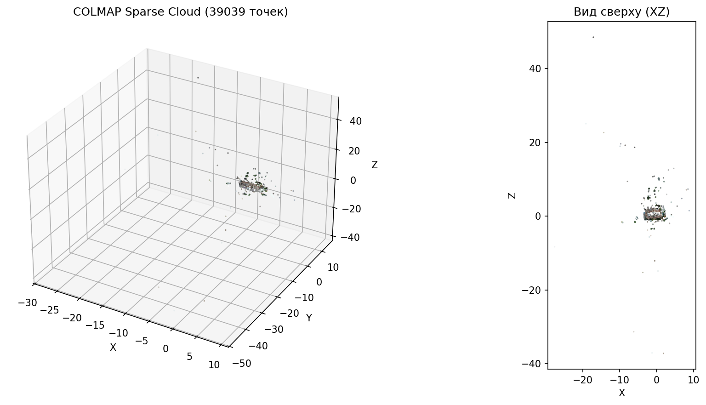
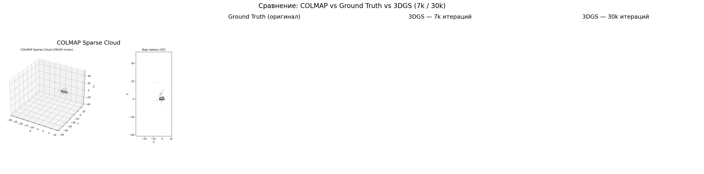
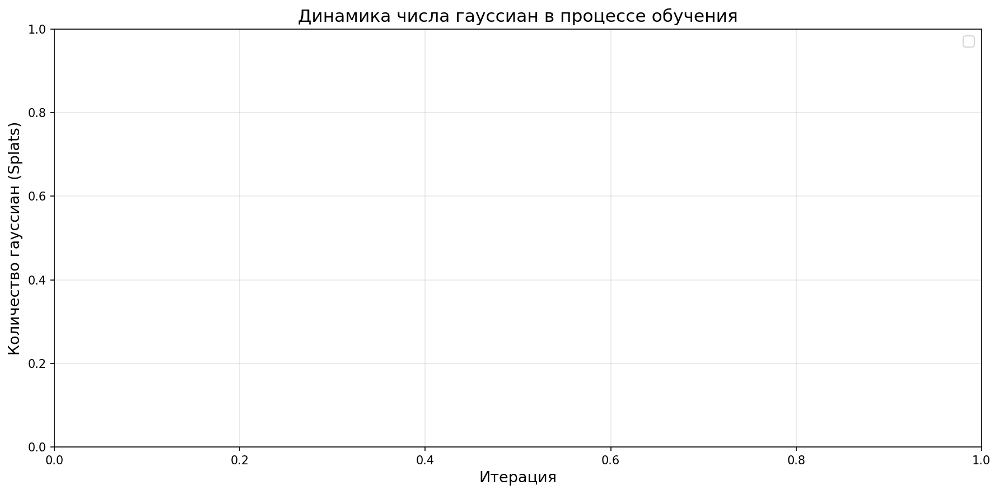
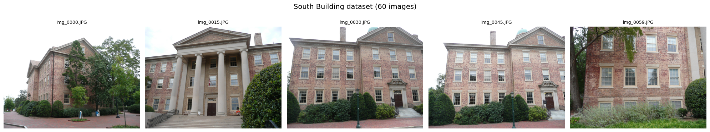

# Advanced Robotics – Homeworks

This repository contains all homework assignments for the **Advanced Robotics** course completed by **Anastassiya Ryabkova**.


---

## HW1 — Hough Line Detector & RANSAC Plane Detector

**📂 File:** [`hm1.ipynb`](hm1.ipynb)

### Task
Two sub-tasks in 2D/3D point cloud processing:
- **HW1.1 — Wall Detection (2D LiDAR + Hough Transform):** Detect straight walls in a 2D LiDAR point cloud using the Hough Transform. Built a Hough accumulator, found peaks, and visualized detected wall lines over LiDAR points.
- **HW1.2 — Ground Detection (RANSAC):** Isolated the ground plane from a 3D point cloud using RANSAC. Randomly sampled 3 points to fit a plane `ax + by + cz + d = 0`, counted inliers, and repeated to find the best plane. Colored floor points and obstacles separately.

### Main Idea
Hough Transform votes in a parameter space (ρ, θ) to find globally consistent lines, while RANSAC robustly fits a geometric model by maximizing consensus among noisy 3D points.

---

## HW2 — Linear Kalman Filter for Smartphone Sensors

**📂 File:** [`hm2/hm2.ipynb`](hm2/hm2.ipynb)  
**📊 Data:** `hm2/Accelerometer.csv`, `hm2/Location.csv`

### Task
Walk ~100–150 m outdoors with a smartphone, record GPS and accelerometer data, then fuse them using a **Linear Kalman Filter** to estimate distance traveled more accurately than GPS alone.

### What Was Done
- Loaded GPS (latitude/longitude) and linear accelerometer data from CSV.
- Converted GPS to distance using the Haversine formula (measurement `z`).
- Estimated noise parameters: `std_acc` from stationary accelerometer segments, `std_meas` from GPS spread.
- Implemented a Linear Kalman Filter with state vector `x = [position, velocity]ᵀ` and accelerometer as control input `u`.

### Main Idea
GPS is accurate but noisy and low-frequency; the accelerometer is high-frequency but drifts. The Kalman Filter optimally fuses both: **predict** using acceleration, **update** using GPS, producing a smoother and more accurate trajectory estimate.

---

## HW3 — Euler-based vs Quaternion-based EKF for Attitude Estimation

**📂 File:** [`hm3/hm3_ekf_attitude_estimation.ipynb`](hm3/hm3_ekf_attitude_estimation.ipynb)  
**📊 Data:** `hm3/Accelerometer.csv`, `hm3/Gyroscope.csv`

### Task
Implement and compare two Extended Kalman Filter (EKF) approaches for smartphone orientation estimation using accelerometer + gyroscope data.

### What Was Done
- Recorded sensor data with deliberate 90° Pitch rotation to trigger Gimbal Lock.
- **Variant A — Euler-based EKF:** State vector `x = [φ, θ, ψ]ᵀ` (Roll, Pitch, Yaw). Integrated gyroscope angular velocities; corrected using gravity projection from accelerometer.
- **Variant B — Quaternion-based EKF:** State vector `x = [q_w, q_x, q_y, q_z]ᵀ`. Updated quaternion via kinematic equation `q̇ = ½ q ⊗ ω` with normalization at each step; Jacobian `H` computed with SymPy.
- Plotted Roll/Pitch/Yaw for both methods on the same graph; analyzed quaternion norm drift before normalization.

### Main Idea
Euler angles suffer from **Gimbal Lock** at 90° Pitch — the system loses one degree of freedom. Quaternions avoid this singularity entirely, at the cost of a slightly more complex prediction step and the need to maintain unit norm.

---

## HW4 — 3D Reconstruction via Gaussian Splatting

**📂 File:** [`hm4/hm4_gaussian_splatting_(2).ipynb`](hm4/hm4_gaussian_splatting_(2).ipynb)  
**📁 Results:** [`hm4/results/`](hm4/results/)

### Task
Build a photorealistic 3D "digital twin" of a real object by combining classical Structure from Motion (SfM/COLMAP) with neural 3D Gaussian Splatting (3DGS).

### What Was Done
1. **Preprocessing (SfM):** Ran COLMAP to extract sparse point cloud and camera poses (intrinsic/extrinsic parameters). Used NerfStudio (`ns-process-data`) for alignment and filtering.
2. **Training (3DGS):** Trained the Gaussian Splatting model in two experiments: **7k iterations** (fast preview) and **30k iterations** (photorealistic). Varied `position_lr_init` to observe its effect on splat distribution.
3. **Analysis:** Compared sparse COLMAP point cloud vs. final GS render from the same viewpoint. Tracked how the number of Gaussians evolved during training.

### Results

| COLMAP Sparse Cloud | COLMAP vs GS Comparison |
|---|---|
|  |  |

| Learning Rate Effect | Gaussian Count During Training |
|---|---|
|  |  |

**Sample input frames:**  


### Main Idea
3DGS represents a scene as a collection of 3D Gaussians (each with position, covariance, opacity, and color via Spherical Harmonics). Rasterization is explicit and differentiable, making it **100× faster** to render than NeRF while achieving comparable or better visual quality.

---

## HW5 — Path Planning (A\* vs RRT vs RRT\*)

**📂 File:** [`HA5_Path_Planning_final.ipynb`](HA5_Path_Planning_final.ipynb)

### Task
Implement a 2D path planning pipeline comparing grid-based search (A\*) with sampling-based methods (RRT/RRT\*), and apply path smoothing post-processing.

### What Was Done
1. **A\* vs RRT:** Implemented both algorithms on occupancy grid maps (custom B&W images + MovingAI benchmark maps). A\* as the optimality baseline, RRT as the standard for high-DOF systems.
2. **RRT\* + Smoothing:** Implemented RRT\* with tree rewiring for asymptotic optimality. Applied path smoothing (gradient descent / Bézier curves) to eliminate jagged segments.
3. **Analysis:** Compared three metrics — path length, computation time, and nodes visited/sampled. Analyzed how map resolution affects A\* speed and why RRT struggles in narrow corridors.

### Main Idea
A\* guarantees the optimal path on a graph but scales poorly with map resolution (exponential memory). RRT\* is probabilistically complete and asymptotically optimal in continuous space, making it suitable for real robot configurations. Smoothing is essential for physically realizable robot trajectories.

---

## Repository Structure

```
advanced_robotics/
├── hm1.ipynb                          # HW1: Hough Transform + RANSAC
├── hm2/
│   ├── hm2.ipynb                      # HW2: Linear Kalman Filter
│   ├── Accelerometer.csv
│   └── Location.csv
├── hm3/
│   ├── hm3_ekf_attitude_estimation.ipynb  # HW3: Euler vs Quaternion EKF
│   ├── Accelerometer.csv
│   └── Gyroscope.csv
├── hm4/
│   ├── hm4_gaussian_splatting_(2).ipynb   # HW4: 3D Gaussian Splatting
│   └── results/                           # Output images
└── HA5_Path_Planning_final.ipynb      # HW5: Path Planning
```
